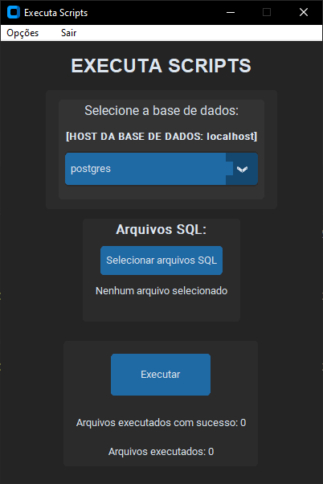

# Executa Scripts

Um utilitário simples feito em python, com interface gráfica feita utilizando TkInter/[customtkinter](https://github.com/TomSchimansky/CustomTkinter), que permite selecionar arquivos SQL em lote para execução em uma base de dados PostgreSQL.<br><br>
A aplicação guarda logs de debug (em [app.log](./log/app.log)) e logs de execução dos arquivos SQL para cada base de dados em [databases](./log/databases/).<br><br>
As pastas e arquivos de log são criados dinamicamente, conforme necessário, ao executar a aplicação. Os logs para a aplicação e para as bases de dados podem ser lidos a partir da aplicação, em `Opções -> Ler logs para a base de dados selecionada` e `Opções -> Ler log da aplicação`, no menu global.<br><br>
Muitos dos logs para `DEBUG` podem ser desnecessários e podem, portanto, ser desativos. Para tal, altere a seguinte linha em [main.pyw](./src/main.pyw):

```
    logging.basicConfig(
        filename=path.join(CONFIGS["APP"]["log_dir"], "app.log"),
        format="[%(asctime)s]:%(levelname)s:%(message)s",
        datefmt="%d/%m/%Y %I:%M:%S %p",
        encoding="utf-8",
        level=logging.DEBUG,
    )
```

Substituindo `level=logging.DEBUG` pelo nível de log desejado, de acordo com o módulo `logging`, da biblioteca padrão do python (documentação em https://docs.python.org/3/library/logging.html)<br><br>
As configurações da aplicação são persistidas no arquivo `CONFIG.ini`, gerado a partir de [CONFIG.ini.example](./CONFIG.ini.example).<br>
Serão solicitados host, senha e base de dados administrativa (comumente `postgres`) para o servidor `postgres` na primeira execução da aplicação. Estes dados também serão armazenados em `CONFIG.ini`, e podem ser alterados a partir do menu global, em `Opções`.<br>



## Criar ambiente virtual

Um ambiente virtual para isolar o projeto pode ser criado com o comando `python -m venv .venv`.
O ambiente virtual pode ser ativado da seguinte maneira:

- Windows: `./.venv/Scripts/Activate.ps1` ou `./.venv/Scripts/activate.bat`
- Linux: `./.venv/bin/activate.sh` ou `./.venv/bin/activate.fish`

E desativado com o comando `deactivate`. Mais informações sobre o módulo `venv` podem ser encontradas em https://docs.python.org/3/library/venv.html.

## Requisitos

Pelo menos [python](https://www.python.org/downloads/) `3.10.11`. Demais requisitos listados no arquivo [requirements.txt](./requirements.txt).
Navegar até a pasta do projeto e fazer o download dos requisitos com o comando:

```
    pip install -r requirements.txt
```

## Executar o projeto

### Windows

- Utilizar o executável compilado com [PyInstaller](https://pyinstaller.org/en/stable/) (disponível nas releases, compilado com python `3.10.11`).
- Executar o arquivo [run.bat](./run.bat).
- Executar [main.pyw](./src/main.pyw) com python (`python src/main.pyw` a partir da pasta raíz do projeto).

### Linux/Mac

- Executar o arquivo [run.sh](./run.sh) (é possível transformá-lo em um executável com o comando `chmod u+x run.sh`).
- Executar [main.pyw](./src/main.pyw) com python (`python src/main.pyw` a partir da pasta raíz do projeto).
- Transformar [main.pyw](./src/main.pyw) em um executável com o comando `chmod u+x ./src/main.pyw` e executá-lo com o comando `./src/main.pyw`.

## Compilar

A aplicação pode ser compilada com [PyInstaller](https://pyinstaller.org/en/stable/) utilizando o seguinte comando, a partir da pasta raíz do projeto:

```
   pyinstaller --clean --onefile .\src\main.pyw --noconsole
```

O projeto compilado estará localizado na pasta `dist/`. É preciso copiar o arquivo [CONFIG.ini.example](./CONFIG.ini.example) para dentro da pasta que contêm o executavel (`dist/`) para que a aplicação funcione.
